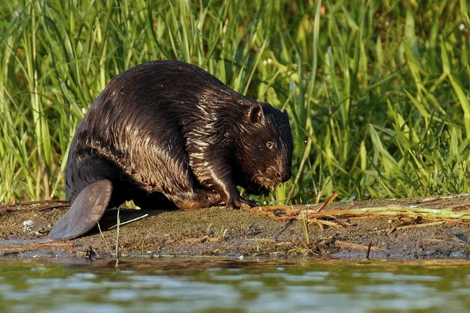

```{r setup, include=FALSE}
knitr::opts_chunk$set(echo = TRUE)
```



Eurasian beaver (*Castor fiber*, Linnaeus, 1758). 

# Objective

Your objective is to calculate the total area of the geographical distribution
of Eurasian beaver. This area is also known as **range size**.

# Useful packages, functions, hints

```{r, message=FALSE, warning=FALSE}
library(raster) # handles raster data
library(sp)     # handles vector, polygon, and point data 
library(rgdal)  # handles geographic projections and data import
library(rgeos)  # calculations with spatial data
```

Potentially **useful functions**: `rasterize`, `gArea`, `gConvexHull`, `SpatialPoints` 

**Hints** to look for: *coastline paradox*, *convex hull*

# Data

## Load the data

```{r, message=FALSE}
# GBIF point observations of Eurasian beaver:
pts <- read.csv("../data/beaver_points/beaver_points_equal_area.csv")

# IUCN range polygon:
shp <- readOGR(dsn = "../data/beaver_shapefile",
               layer = "beaver_shape_equal_area")

# polygon of political boundaries
borders <- readOGR(dsn = "../data/global_boundaries",
                   layer = "world_equal_area")

# a raster of mean annual temperature
rast <- raster("../data/global_raster/annual_T_equal_area.tif")
```

## Plot the data

```{r, fig.width= 10, fig.height=7}
plot(rast, box=FALSE, axes=FALSE, col = gray.colors(100))
plot(shp, add=TRUE, col="lightblue", border=NA)
points(pts, cex=0.2, col="blue")
plot(borders, add=TRUE, border="white")
```