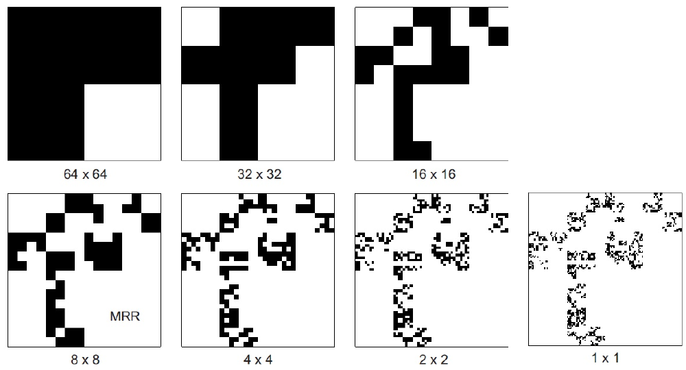
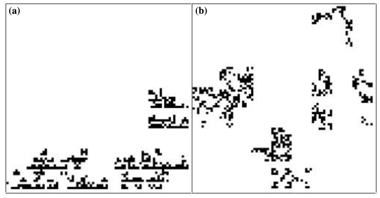
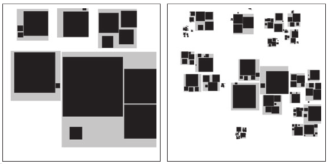

```{r setup, include=FALSE}
knitr::opts_chunk$set(echo = TRUE)
```

# Objective

Your objective is to write a simple function or program or script that will
generate fractal distribution of a species on a grid. Ideally a `raster` object.


## Examples of fractal distributions:


Keil, Wilson & Jetz (2014) *Diversity and Distributions*



Halley et al. (2004) *Ecology Letters*



Storch et al. (2008) *Ecology Letters*

## Why should the distributions be fractal?

Have a look [here](https://andreacasalotti.wordpress.com/2013/03/25/fractals-in-nature/).


## Papers on fractals in ecology 

- [Brown et al. 2002](http://www.fractal.org/Bewustzijns-Besturings-Model/Fractal-Nature.pdf) on fractal nature of nature.
- [Lennon et al. 2002](http://personal.victoria.ac.nz/stephen_hartley/pdfs/Lennon%20et%20al%2002%20OIKOS%20fractal%20SAR.PDF) makes the point that fractal species distributions do not produce power-law species area relationship. 
- [Halley et al. 2004](http://www.uvm.edu/~pdodds/files/papers/others/2004/halley2004a.pdf) provide, to my knowledge, the most useful and authoritative practical intro to fractals in ecology.
- [Storch et al. 2008](http://www.cts.cuni.cz/~storch/publications/Storch_et_al_2008.pdf) idea of "generalized fractals" in ecology.

