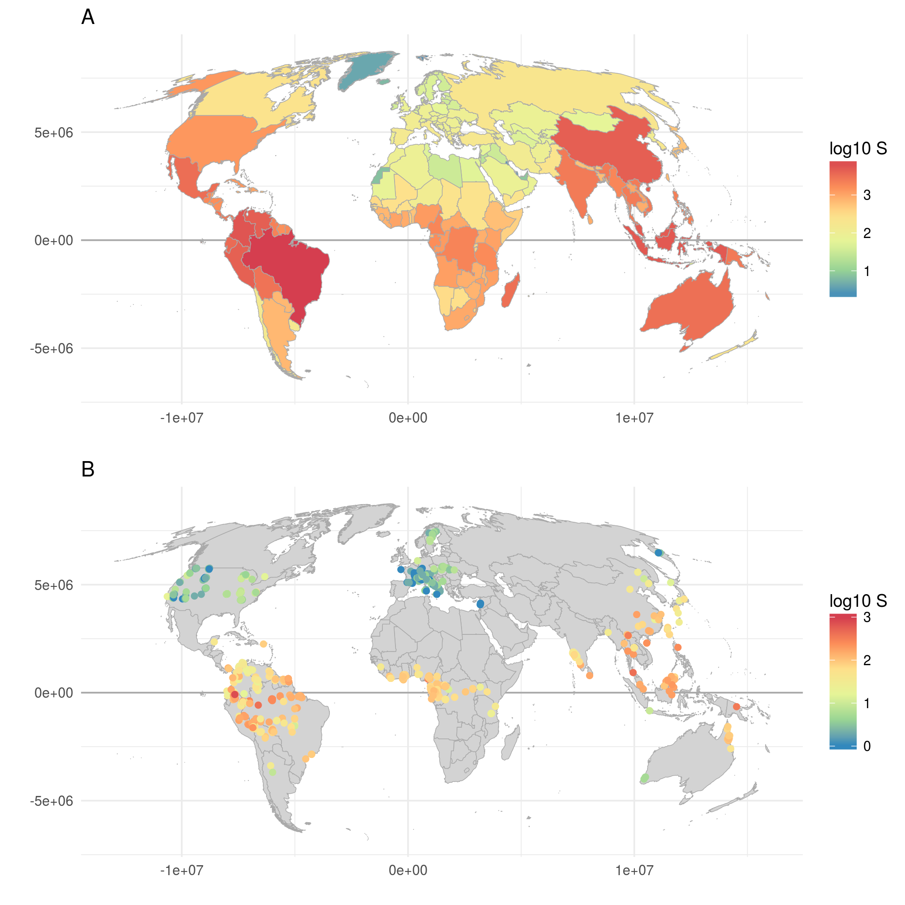

```{r setup, include=FALSE}
knitr::opts_chunk$set(echo = TRUE)
```

# Objective

Your task is to use the data to **estimate species richness of all
mainland mammals, tiger beetles, and butteflies**. The total area of mainlands is
510,072,000 $km^2$.

# Data

There are 4 data sets:

- Global dataset on all **trees**, which is an unpublished dataset that I currently use,
compiled from [Global Tree Search](http://www.bgci.org/global_tree_search.php), and global databases of forest plots [Forestplots.net](http://www.forestplots.net/), [CTFS forest plots](http://www.ctfs.si.edu/plots/summary/), and many plots manually extracted from 
primary literature.

- Global data on all terrestrial **mammals** from [IUCN redlist](http://www.iucnredlist.org/).

- Global data on all **tiger beetles** from Cassola and Pearson (2000) Biological Conservation 95: 197-208.

- Global data on **butterflies** from Europe, Africa, and some other locations. Sources are listed in the dataset.


## Map of tree species richness




## Load the data to R from the web

```{r}
trees <- read.csv("http://www.petrkeil.com/wp-content/uploads/2018/01/trees.csv")

mammals <- read.csv("http://www.petrkeil.com/wp-content/uploads/2017/09/mammals.csv")

beetles <- read.csv("http://www.petrkeil.com/wp-content/uploads/2017/09/tiger_beetles.csv") 

btflies <- read.csv("http://www.petrkeil.com/wp-content/uploads/2017/09/butterflies.csv")
```


## Plot the raw data

```{r, fig.height=8, fig.width=8}
plot(log(trees$Area), log(trees$S), 
     xlab="log Area [km^2]", 
     ylab="log S")
points(log(mammals$Area), log(mammals$S), col="orange")
points(log(beetles$Area), log(beetles$S), col="blue")
points(log(btflies$Area), log(btflies$S), col="red", pch=19)
legend("topleft", pch=c(1,1,1,19), 
       col=c("black", "orange", "blue", "red"),
       legend=c("Trees","Mammals","Tiger beetles","Butterflies"))
```

# Hint

Fig. 5 [here](https://github.com/petrkeil/Teaching_Halle_2018/blob/master/papers/global_richness_estimation/Fridley_2005_ECOLOGY.pdf).


